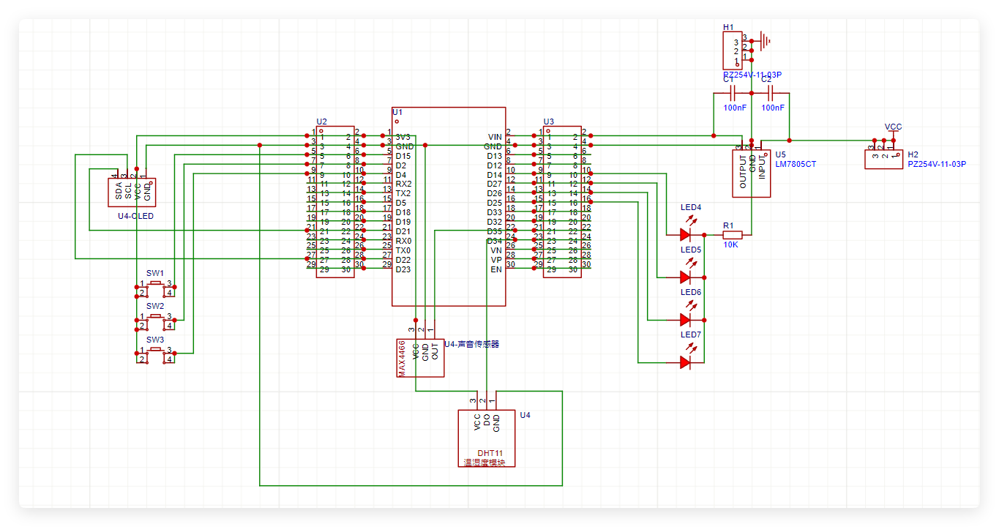
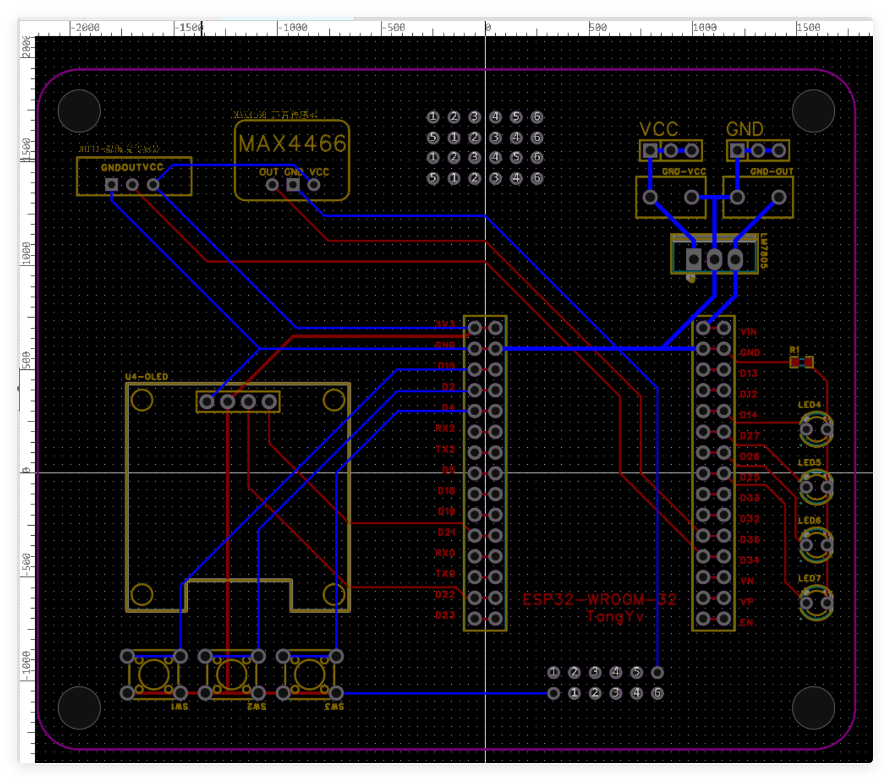

# 项目报告：基于ESP32的智能灯光控制系统

## 项目概述

本项目基于ESP32微控制器，设计并实现了一个智能灯光控制系统。系统通过OLED显示屏提供用户交互界面，实现了灯光的多种控制模式,具有温湿度检测、声音检测功能。

***系统支持通过HTTP服务器进行远程控制。***

## 系统架构

### 硬件架构

- **单片机模块**：ESP32-WROOM-32(*为便于调试将引脚通过排母与PCB连接*)
- **输出模块**：0.96英寸I2C OLED显示屏（128x64分辨率）
- **交互模块**：3个按键（用于菜单导航）
- **灯光**：RGB LED灯（红、绿、黄三色）
- **传感器**：
  - DHT11（温湿度传感器）
  - MAX4466（声音传感器）

- **原理图**

- **PCB图**

### 软件架构

- **主程序模块**：负责系统初始化、中断处理和主循环。

~~~c++
void setup()
{
    Serial.begin(115200);
    pinInit();
    interruptInit();
    oledInit(&oledStatus);      // 初始化OLED显示屏
    menuSpawner(&oledStatus);   // 构建菜单二叉树
    oledStatus.start(MainMenu); // 主菜单显示

    initWebServer(); // 初始化 HTTP 服务器
}

void loop()
{
    interruptHandler();
    managerUpdate(); // 处理 HTTP 请求
}
~~~

- **菜单系统模块**：基于OLED显示屏的菜单导航系统，以二叉树结构组织菜单项,可高度定制。

~~~text
MainMenu
├── DengCtrl
│   ├── Y_Mode(按下开反之关)
│   ├── N_Mode(按下关反之开)
│   └── T_Mode(按下切换亮灭)
├── DengSet
│   ├── Color(红、绿、黄)
│   ├── Blink(闪烁频率)
│   ├── Intensity(亮度)
│   └── Run(运行)
└── Detect
    ├── Humiture(温湿度)
    └── VOL_Voltage(声音传感器&电压测量)
~~~

- **灯光控制模块**：多种控制模式,可自定义参数(可通过HTTP进行更细节的控制)。
  - 颜色：支持红、绿、黄三色灯光控制。
  - 闪烁：支持自定义闪烁频率(采用硬件定时器),设置闪烁频率为零时关闭闪烁。
  - 亮度：支持0-255范围的亮度调节(使用ESP32的PWM调制),设置亮度为0时为进入呼吸灯模式。
- **数据检测模块**：实现温湿度检测和声音检测。
  - 温湿度直接执行即可
  - 声音检测与电压测量共用引脚
- **网络模块**：基于HTTP服务器的远程控制。
  - 连接同一局域网后访问mDNS地址: <http://esp32-manager.local>
  - 也可通过启动后OLED显示的IP地址访问
  - 网页中可直接执行部分功能,且提供更自由的参数设置,同时网页也提供了虚拟的菜单控制按键。

## 代码结构

项目代码分为main(主函数)、config(引脚,参数配置)、interruptHandler(中断配置)、menuCtrler(菜单定义,实现)、menuSpawner(菜单生成模块)、OLED_Power(屏幕控制)、Manager(网络控制)等文件，便于维护和扩展。以下是主要文件及其功能：

### 1. `main.cpp`

- **功能**：主程序入口，负责系统初始化和主循环。
- **主要函数**：
  - `setup()`：初始化串口、引脚、中断、OLED显示屏、菜单系统和HTTP服务器。
  - `loop()`：处理中断和HTTP请求。

### 2. `config.h`

- **功能**：配置文件，定义系统参数、引脚配置和常量。
- **主要内容**：
  - 采样窗口时间（`sampleWindow`）。
  - 按键引脚（`btnPin1`、`btnPin2`、`btnPin3`）。*btn1:返回，btn2:选择，btn3:下一个*
  - 灯引脚（`ledPin`、`Yellow`、`Green`、`Red`）。
  - OLED显示屏参数（宽度、高度、SDA和SCL引脚）。
  - WiFi配置（SSID和密码）。

### 3. `interruptHandler.h`

- **功能**：处理按键中断和中断标志位。
- **主要内容**：
  - 按键中断服务函数（`ISRNext`、`ISRSelect`、`ISRBack`）。
  - 中断初始化函数（`interruptInit`）。
  - 中断处理函数（`interruptHandler`），包括按键处理和工作指示。

### 4. `main.h`

- **功能**：主头文件，声明全局对象和函数。
- **主要内容**：
  - OLED对象（`oled`）和菜单控制器对象（`oledStatus`）。
  - 初始化函数声明（`pinInit`、`interruptInit`、`oledInit`）。

### 5. `menuCtrler.h`(自研!!!)

- **功能**：实现菜单控制器类（`MENU`和`OLEDStatus`）。
- **主要内容**：
  - 菜单类（`MENU`），定义菜单名称、父菜单、子菜单、功能函数等。
  - OLED状态类（`OLEDStatus`），管理菜单显示和用户交互。

### 6. `menuSpawner.h`

- **功能**：构建菜单系统，定义菜单项和功能函数。
- **主要内容**：
  - 一级菜单（`MainMenu`）和二级菜单（`DengCtrl`、`DengSet`、`Detect`）。
  - 灯控模式菜单（`Y_Mode`、`N_Mode`、`T_Mode`）。
  - 亮度调节菜单（`Color`、`Blink`、`Intensity`、`Run`）。
  - 数据检测菜单（`Humiture`、`VOL_Voltage`）。

### 7. `OLED_Power.h`

- **功能**：初始化OLED显示屏。
- **主要内容**：
  - OLED初始化函数（`OLED_init`），配置I2C总线和显示屏参数。
  - (更多功能如显示文本、图像等的封装尚未完成)

### 8. `Manager.h`

- **功能**：实现HTTP服务器功能，支持远程控制和状态监控。
- **主要内容**：
  - HTTP服务器初始化（`initWebServer`）。
  - 路由处理函数（`handleRoot`、`handleRun`、`handleKey`）。
  - 服务器更新函数（`managerUpdate`）。

## 结论

本项目实现了基于ESP32的智能灯光控制系统，具备灯光控制、环境数据检测和远程控制功能。系统界面友好，操作简单，扩展性强，可应用于红绿灯?

---
